## Hola, Mi nombre es Saray

## DESARROLLADORA WEB · SOPORTE TÉCNICO Y SISTEMAS

Me apasiona desarrollar aplicaciones y sitios web que combinen funcionalidad, rendimiento y una experiencia de usuario intuitiva. Disfruto creando interfaces modernas, accesibles y responsive, cuidando tanto la calidad del código como los detalles del diseño.

Actualmente participo en proyectos reales para clientes y en proyectos colaborativos, donde continúo ampliando mis conocimientos y aplicando nuevas tecnologías para desarrollar soluciones funcionales, escalables y centradas en el usuario.

---

## Sobre mí

* Desarrollo aplicaciones y sitios web modernos.
* Me interesa especialmente el diseño de interfaces (UI) y la experiencia de usuario (UX).
* Disfruto aprendiendo nuevas tecnologías y aplicándolas en proyectos reales.
* Complemento mi perfil con conocimientos en soporte técnico, sistemas operativos y virtualización.
* Siempre busco escribir código limpio, mantenible y fácil de escalar.

---

## Tecnologías

### Desarrollo Web

         

### Herramientas

        

### Sistemas y Soporte Técnico

   

### Actualmente aprendiendo

 

---

## Competencias

* Desarrollo de aplicaciones web
* Diseño de interfaces responsive
* Experiencia de usuario (UI/UX)
* Gestión de bases de datos
* Control de versiones
* Despliegue de aplicaciones
* Administración de entornos de desarrollo
* Virtualización de sistemas
* Soporte técnico remoto
* Resolución de incidencias
* Inteligencia Artificial aplicada al desarrollo

---

## Proyectos Destacados

### [Reading World](https://github.com/tu-usuario/reading-world)

Aplicación para compartir libros, reseñas y recomendaciones entre usuarios.

---

### [CRM para Gestión de Sitios Web](https://github.com/tu-usuario/crm-web)

Herramienta desarrollada para administrar el contenido de diferentes sitios web.

---

### [Reading App](https://github.com/tu-usuario/reading-app)

Proyecto colaborativo centrado en el desarrollo de funcionalidades y diseño de la interfaz.

---
  
### 🎮 [Video Game Universe](https://github.com/tu-usuario/video-game-universe)

Sitio web responsive dedicado al mundo de los videojuegos, con diseño moderno y una experiencia optimizada para distintos dispositivos.
  

---

## Actualmente

* Desarrollando nuevos proyectos web.
* Mejorando mis conocimientos en UI/UX.
* Aprendiendo Python para ampliar mis competencias.
* Explorando nuevas herramientas de Inteligencia Artificial aplicadas al desarrollo de software.

---

## Objetivo

Seguir creciendo como desarrolladora web, participando en proyectos que me permitan crear aplicaciones útiles, intuitivas y bien diseñadas, mientras continúo aprendiendo nuevas tecnologías y mejorando tanto mis habilidades técnicas como mi visión del diseño y la experiencia de usuario.

---

## Contacto

  
